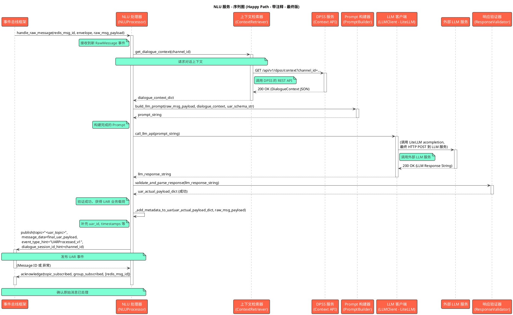
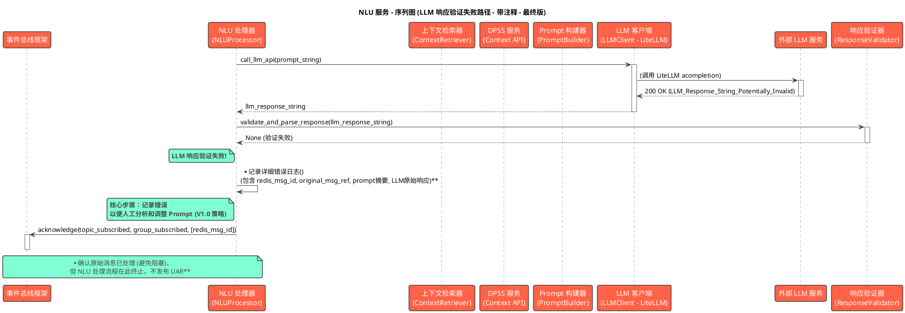

## **NLU 服务 (NLU Service)**

### **1. 概述与职责** 🎯

NLU 服务 (Natural Language Understanding Service) 是 AI-RE 助手系统的核心理解单元。其主要职责是：
* 通过**公共事件总线框架**订阅并消费来自输入服务的 `user_message_raw` 事件。
* 调用 **DPSS 服务** 的 REST API 获取必要的对话历史上下文 (`DialogueContext`)。
* 基于 `user_message_raw` 和获取到的上下文，利用**Prompt 构建器**构建适合大语言模型 (LLM) 的、包含专业需求工程指导和示例的 Prompt。
* 通过 **LLM 客户端** (推荐使用 `LiteLLM` 作为底层库) 调用外部的 LLM 服务。
* 使用**响应验证与解析器**处理 LLM 的响应，将其转换为结构化的**话语分析结果 (UAR)** (作为事件信封的 `actual_payload`)，并进行严格的 Schema 验证。
* **NLU 在识别 `ModifyExistingREI` 意图时，主要聚焦于其接收到的有限上下文（焦点REI、近期历史）。如果用户意图是修改一个不在这个有限上下文中的REI，NLU 可能无法直接关联，此时DPSS将承担后续的匹配和澄清职责。**
* 在 V1.0 版本中，如果 LLM 调用或响应验证失败，服务将**记录详细错误并停止当前消息的处理**，等待人工干预调整 Prompt 并手动重新触发。
* 通过**公共事件总线框架**将成功的 UAR 发布出去，供 DPSS 服务消费。

---

### **2. 模块内部结构设计 (Internal Structure Design)** 🏗️

#### **2.1 核心类/组件**

NLU 服务内部主要由以下概念性类/组件构成：

1.  **`NLUProcessor` (NLU 处理器):**
    * **描述:** NLU 服务的核心控制器和协调器。它由事件总线框架在收到新消息时调用，并负责驱动整个 NLU 流程。
2.  **`ContextRetriever` (上下文检索器):**
    * **描述:** 负责从 DPSS 服务获取对话历史上下文。
3.  **`PromptBuilder` (Prompt 构建器):**
    * **描述:** 根据输入的 `user_message_raw`、检索到的上下文以及预定义的 Prompt 模板，动态构建最终发送给 LLM 的 Prompt 文本。
4.  **`LLMClient` (LLM 客户端):**
    * **描述:** 负责与外部 LLM 服务进行 HTTP/S REST API 通信。**推荐使用 `LiteLLM` 库作为其底层实现**，以支持多种 LLM 后端并简化 API 调用。
5.  **`ResponseValidator` (响应验证与解析器):**
    * **描述:** 接收 LLM 返回的响应，尝试将其解析为 JSON，并使用 Pydantic 模型严格验证其是否符合 UAR JSON Schema。

#### **2.2 类图 (Class Diagram)**

```plantuml
@startuml
!theme vibrant
title NLU 服务 - 类图 (概念性 - 最终版)

interface IEventBus {
  + publish(topic: str, message_data: dict, event_type_hint: str | None, dialogue_session_id_hint: str | None): str | None
  + subscribe(topic: str, handler: Callable, group: str | None, consumer: str | None, create_group: bool, start_id: str, auto_ack: bool): void
}
note top of IEventBus : 事件总线框架接口

class NLUProcessor {
  - event_bus: IEventBus
  - context_retriever: ContextRetriever
  - prompt_builder: PromptBuilder
  - llm_client: LLMClient
  - response_validator: ResponseValidator
  + async handle_raw_message(redis_msg_id: str, event_envelope: dict, raw_message_payload: dict): void
  # async _get_context_for_message(channel_id: str): dict | None
  # async _build_prompt(raw_message: dict, context: dict | None): str | None
  # async _call_llm_and_validate(prompt: str, raw_message: dict): dict | None
}
note top of NLUProcessor : NLU 服务核心控制器

class ContextRetriever {
  - dpss_api_client: httpx.AsyncClient
  - dpss_context_url: str
  + async get_dialogue_context(channel_id: str, limit: int): dict | None
}
note top of ContextRetriever : 从 DPSS 获取上下文

class PromptBuilder {
  - prompt_templates: dict # 外部加载的模板字符串
  + build_llm_prompt(raw_message_payload: dict, dialogue_context: dict | None, uar_json_schema_def: str): str
}
note top of PromptBuilder : 构建 LLM Prompt

class LLMClient {
  - default_model: str
  - default_temperature: float
  - default_max_tokens: int
  # 使用 LiteLLM 后，API Key 通常由环境变量管理
  + async call_llm_api(prompt_content: str, model: str | None): str | None
}
note top of LLMClient : 调用外部 LLM API (推荐使用 LiteLLM)

class ResponseValidator {
  - uar_schema_model: Type[BaseModel] # Pydantic UAR Model
  + validate_and_parse_response(llm_response_str: str): dict | None
}
note top of ResponseValidator : 验证和解析 LLM 响应

NLUProcessor o-- IEventBus
NLUProcessor o-- ContextRetriever
NLUProcessor o-- PromptBuilder
NLUProcessor o-- LLMClient
NLUProcessor o-- ResponseValidator

hide empty members
@enduml
```



#### **2.3 关键函数/方法说明 (Function/Method Specification)**

`NLUProcessor` 的 `handle_raw_message` 方法通过调用以下内部辅助方法来编排 NLU 流程，以提高可读性和单元测试性：

* **`async def _get_context_for_message(self, channel_id: str) -> Optional[dict]:`**
    * **输入参数:** `channel_id` (str): 当前消息的频道 ID。
    * **输出:** `Optional[dict]`: 从 DPSS 获取的对话上下文数据，如果获取失败则为 `None`。
    * **核心逻辑:**
        1.  构造对 DPSS Context API 的 HTTP GET 请求。
        2.  调用 `self.context_retriever.get_dialogue_context(channel_id)`。
        3.  处理可能的异常（如网络错误、DPSS API 返回错误状态码），记录错误。
        4.  如果成功，返回解析后的上下文 JSON 字典；否则返回 `None`。

* **`async def _build_prompt(self, raw_message_payload: dict, context: Optional[dict]) -> Optional[str]:`**
    * **输入参数:**
        * `raw_message_payload` (dict): `user_message_raw` 的业务载荷，包含 `raw_text`, `user_id`, `message_id`, `channel_id` 等。
        * `context` (Optional[dict]): 从 DPSS 获取的对话上下文 (`DialogueContext` 结构)。
    * **输出:** `Optional[str]`: 构建好的、准备发送给 LLM 的完整 Prompt 字符串；如果构建失败（例如模板问题）则为 `None`。
    * **核心逻辑:**
        1.  从 `raw_message_payload` 中提取核心信息 (如 `raw_text`, `user_id`, `message_id`, `channel_id`)。
        2.  获取 UAR JSON Schema 的字符串表示 (用于注入到 Prompt 中)。
        3.  调用 `self.prompt_builder.build_llm_prompt(raw_message_core_info, context, uar_json_schema_def)`，将这些信息填充到预定义的 Prompt 模板 (V1.3 版本) 中。
        4.  处理可能的模板渲染错误或参数缺失错误，记录错误。
        5.  返回构建好的 Prompt 字符串。

* **`async def _call_llm_and_validate(self, prompt: str, original_message_id_for_log: str) -> Optional[dict]:`**
    * **输入参数:**
        * `prompt` (str): 发送给 LLM 的完整 Prompt。
        * `original_message_id_for_log` (str): 原始消息的 ID，用于日志记录。
    * **输出:** `Optional[dict]`: 如果 LLM 调用成功且响应通过验证，则返回符合 UAR Schema 的业务载荷字典；否则返回 `None`。
    * **核心逻辑:**
        1.  记录准备调用 LLM 的日志（可包含 Prompt 的摘要或长度，避免记录完整敏感 Prompt）。
        2.  调用 `self.llm_client.call_llm_api(prompt)` 获取 LLM 的原始响应字符串。
        3.  如果 LLM 调用失败（例如，API 错误、超时、返回空响应），记录详细错误（包含 `original_message_id_for_log` 和错误信息）并返回 `None`。
        4.  如果 LLM 调用成功，将响应字符串传递给 `self.response_validator.validate_and_parse_response()`。
        5.  如果验证和解析成功，返回 UAR 业务载荷。
        6.  如果验证失败（例如 JSON 格式错误，或不符合 UAR Schema），记录详细错误（包含 `original_message_id_for_log` 和 LLM 的原始响应内容）并返回 `None`。

* **`async def handle_raw_message(self, redis_msg_id: str, event_envelope: dict, raw_message_payload: dict) -> None:`** (主编排方法)
    * **输入参数:**
        * `redis_msg_id` (str): 事件在 Redis Stream 中的 ID。
        * `event_envelope` (dict): 完整的事件信封。
        * `raw_message_payload` (dict): `RawMessage` 的业务载荷。
    * **输出:** 无。处理结果通过事件总线发布新的 UAR 事件，或记录错误。
    * **核心处理逻辑:**
        1.  从 `raw_message_payload` 提取 `channel_id` 和 `message_id` (作为 `original_message_ref`)。
        2.  调用 `await self._get_context_for_message(channel_id)` 获取对话上下文。
        3.  调用 `await self._build_prompt(raw_message_payload, context)` 构建 Prompt。如果 Prompt 构建失败，记录错误，调用 `self.event_bus.acknowledge(...)` 确认原始消息（避免阻塞），然后返回。
        4.  调用 `await self._call_llm_and_validate(prompt, original_message_ref)` 获取并验证 LLM 响应。
        5.  如果 `_call_llm_and_validate` 返回 `None` (表示 LLM 调用失败或响应验证失败)：
            * （错误已在辅助方法中记录）
            * 调用 `self.event_bus.acknowledge(...)` 确认原始消息。
            * **V1.0 策略：流程终止**，等待人工干预（例如，调整 Prompt 模板、检查 LLM 服务状态）。
        6.  如果成功获取并验证了 UAR 业务载荷 (`uar_actual_payload`):
            * **补充 UAR 元数据:**
                * `uar_actual_payload["uar_id"] = str(uuid.uuid4())` (或使用事件总线生成的 `event_id`)
                * `uar_actual_payload["original_message_ref"] = original_message_ref`
                * `uar_actual_payload["user_id"] = raw_message_payload.get("user_id")`
                * `uar_actual_payload["channel_id"] = channel_id`
                * `uar_actual_payload["processing_timestamp_utc"] = datetime.utcnow().isoformat() + "Z"`
                * `uar_actual_payload["raw_text_processed"] = raw_message_payload.get("raw_text")`
                * `uar_actual_payload["status"] = "success"` (如果前面都成功了)
            * 调用 `self.event_bus.publish(topic="<uar_results_topic_from_config>", message_data=uar_actual_payload, event_type_hint="UARProcessed_v1", dialogue_session_id_hint=channel_id)`。
            * 如果发布成功，记录成功日志。如果发布失败，记录严重错误。
            * 调用 `self.event_bus.acknowledge(...)` 确认原始消息。
        7.  **关于 ACK 的时机:** ACK 应在 NLU 服务对此消息的所有处理（无论是成功发布UAR还是决定放弃处理并已记录错误）完成后执行，以确保消息不会在处理中途丢失或被错误地重投。

#### **2.A Prompt 工程策略 (Prompt Engineering Strategy - V1.3 最终版)**

```text
您是一位经验丰富、技术精湛的 AI 需求工程分析师。您的核心任务是深度分析用户在需求讨论中的发言，精准识别其意图，并从中抽取结构化的**需求工程元素 (Requirements Engineering Elements, REIs)**，如高层目标 (Goal)、具体功能需求 (FunctionalRequirement)、非功能需求 (NonFunctionalRequirement)、用户角色/参与者 (Actor)、约束 (Constraint)、待讨论问题 (Issue) 以及重要数据对象 (DataObject)。这些需求工程元素是构建需求知识图谱的基本单元。

## 任务目标:
基于用户当前的发言，并参考提供的对话上下文（历史对话、当前焦点需求、待澄清问题），请完成以下分析：

1.  **意图识别 (Intent Recognition):** 判断用户此番发言的主要沟通意图。意图名称必须是预定义枚举中的一个。**特别注意，如果用户发言明显是对“当前讨论焦点 REI 摘要”或“最近对话历史”中提及的需求元素进行补充、修改或详细阐述，应优先考虑识别为 "ModifyExistingREI" 意图，并尝试在 UAR 的 `intent.target_rei_id` 字段中填入被修改的 REI 的 ID (从上下文中获取)。如果无法从提供的上下文中明确找到被修改的 REI ID，则此字段可为 null，但意图仍可判断为 "ModifyExistingREI" （后续系统将尝试更大范围匹配）。**
2.  **实体抽取 (Entity Extraction):** 识别并提取上述提及的各类**需求工程实体 (REIs)**。这些实体的内容会涉及用户讨论的具体业务领域，但其实体类型必须是预定义的枚举值。明确其实体类型、在原文中的具体表述 (text_span)、以及从发言中能推断出的核心属性。
3.  **关系抽取 (Relation Extraction):** 识别实体之间可能存在的、符合需求工程逻辑的关联关系。关系类型必须是预定义的枚举值。
4.  **模糊性标记 (Ambiguity Tagging):** 指出实体描述中任何模糊不清、需要进一步量化的表述，并提供具体原因和模糊文本片段。

## 输出格式 (严格遵循此 JSON Schema):
您的输出必须是一个结构良好、可被程序解析的 JSON 对象。请勿添加任何 JSON 之外的解释性文字。
```json
{{UAR_JSON_SCHEMA_DEFINITION_PLACEHOLDER}} 
```
请确保您的输出严格符合此 Schema，包括所有必需字段和正确的数据类型。

## 意图名称枚举值及其含义与示例:
`intent.name` 字段必须从以下枚举值中选择：
* `"ProposeNewREI"`: 用户提出了一个新的、之前未明确讨论过的需求元素。
    * 示例: "系统应该允许用户自定义界面主题。"
* `"ModifyExistingREI"`: 用户对一个**已提及或已存在于上下文（特别是“当前讨论焦点 REI”或“最近对话历史”）**的需求元素进行了补充、修改、提供了更多细节或修正。
    * 示例: (上下文有 FR-101: "用户登录") 用户说: "关于用户登录，我们还需要支持手机号验证码登录。" -> 此时应尝试在 UAR 的 `intent.target_rei_id` 字段填入 "FR-101"。
* `"ProvideClarification"`: 用户针对系统或他人的提问，提供了澄清信息。
    * 示例: (系统问: "您说的快速具体指什么？") 用户答: "我的意思是页面加载时间应少于1秒。"
* `"ConfirmUnderstanding"`: 用户确认了系统或其他人的理解。
    * 示例: "对，就是这个意思。"
* `"DenyUnderstanding"`: 用户否认或不同意系统或其他人的理解。
    * 示例: "不完全是，我的侧重点在于..."
* `"AskQuestion"`: 用户提出了一个问题。
    * 示例: "这个新功能会影响性能吗？"
* `"GeneralStatement"`: 用户做了一个一般性陈述，与具体需求元素关联较弱。
    * 示例: "这个项目很有挑战性。"
* `"ChitChat"`: 闲聊或与需求无关的对话。
    * 示例: "午饭吃什么？"
* `"Unknown"`: 无法明确判断用户意图。

## 需求工程实体类型 (Entity Types) 参考与示例:
`entities.type` 字段必须从以下枚举值中选择：
* `"Goal"`: 用户或业务的高层目标或期望达成的成果。
    * 含义: 描述系统或项目要达成的战略性目的。
    * 示例发言片段: "我们的主要目标是**提升客户留存率**。"
* `"FunctionalRequirement"` (FR): 系统必须执行的具体功能或提供的服务。
    * 含义: 描述系统应该“做什么”。
    * 示例发言片段: "用户**应该能够在线支付订单**。"
* `"NonFunctionalRequirement"` (NFR): 系统的质量属性，如性能、安全性、易用性等。
    * 含义: 描述系统应该“做得多好”或具备何种特性。
    * 示例发言片段: "**系统响应时间必须在2秒以内**。"
* `"Actor"`: 与系统交互的用户角色、人员、外部系统或组织。
    * 含义: 谁会使用或与系统互动。
    * 示例发言片段: "**注册会员**可以查看历史购买记录。"
* `"Constraint"`: 对系统设计、实现或项目执行的限制或约束。
    * 含义: 必须遵守的限制条件。
    * 示例发言片段: "**项目预算不得超过50万**。" 或 "**系统必须使用Java开发**。"
* `"Issue"`: 用户在讨论中提出的疑问、关注点、潜在风险或待解决的问题。
    * 含义: 对话中出现的需要注意或解决的点。
    * 示例发言片段: "我担心**数据迁移的风险会很高**。"
* `"DataObject"`: 系统需要处理、存储或引用的重要数据实体或信息。
    * 含义: 系统操作的数据对象。
    * 示例发言片段: "我们需要存储**用户的订单信息和收货地址**。"
* `"SystemComponent"`: 系统的某个主要模块或组成部分。
    * 含义: 系统的逻辑或物理构成单元。
    * 示例发言片段: (如果用户提及) "**支付模块**需要对接银行接口。"
* `"UserStory"`: 一种特定的需求表达方式，通常格式为“作为<角色>, 我想要<活动>, 以便<商业价值>”。
    * 含义: 从用户视角描述其目标和动机。
    * 示例发言片段: "**作为普通顾客，我想要将商品添加到购物车，以便我稍后可以一起结算。**"
* `"UseCase"`: 描述一组用户与系统交互以达成特定目标的场景。
    * 含义: 用户如何使用系统完成特定任务。
    * 示例发言片段: (如果用户按用例方式描述) "用户**通过登录、搜索商品、加入购物车、结算步骤完成购买**。"
* `"Stakeholder"`: 对项目结果有兴趣或会受其影响的个人或团体。
    * 含义: 需求的相关方。
    * 示例发言片段: "**市场部**希望系统能提供用户行为分析报告。"

## 关系类型 (Relation Types) 参考与示例:
`relations.type` 字段必须从以下枚举值中选择，用于连接上述抽取的实体：
* `"REFINES"`: 一个需求元素是对另一个更高层元素的细化或具体化。
    * 含义: A 是 B 的具体化。
    * 示例: `FR("在线支付")` --REFINES--> `Goal("提升购物便捷性")`
* `"CONTAINS"` / `"PART_OF"`: 一个元素在逻辑上包含另一个元素，或另一个元素是其组成部分。
    * 含义: A 包含 B 或 B 是 A 的一部分。
    * 示例: `FR("用户管理")` --CONTAINS--> `FR("修改用户密码")`
* `"DEPENDS_ON"`: 一个需求元素的实现或存在依赖于另一个。
    * 含义: A 的实现需要 B。
    * 示例: `FR("生成报告")` --DEPENDS_ON--> `DataObject("销售数据")`
* `"AFFECTS"`: 一个元素（如约束、NFR、Issue）对另一个元素产生影响。
    * 含义: A 影响 B。
    * 示例: `Constraint("特定加密算法")` --AFFECTS--> `FR("用户认证")`
* `"CONFLICTS_WITH"`: 两个需求元素之间存在逻辑冲突或矛盾。
    * 含义: A 与 B 存在冲突。
    * 示例: `FR("允许匿名评论")` --CONFLICTS_WITH--> `NFR("所有内容需实名追溯")`
* `"INVOLVES"`: 某个场景或功能涉及到某个角色或数据对象。
    * 含义: A 涉及到 B。
    * 示例: `FR("查看订单")` --INVOLVES--> `Actor("注册用户")`
* `"QUALIFIES"`: 一个 NFR 用来限定或修饰一个 FR 或 Goal。
    * 含义: A 对 B 进行了质量限定。
    * 示例: `NFR("响应时间小于1秒")` --QUALIFIES--> `FR("搜索商品")`
* `"ADDRESSES"`: 一个 FR 或系统方案旨在解决某个 Issue 或达成某个 Goal。
    * 含义: A 旨在解决/达成 B。
    * 示例: `FR("增加客服入口")` --ADDRESSES--> `Issue("用户反馈渠道不畅通")`
* `"RELATES_TO"`: 当其他关系类型不适用时，表示两个元素之间存在某种一般性关联。
    * 含义: A 与 B 相关。
    * 示例: `DataObject("用户信息")` --RELATES_TO--> `DataObject("地址信息")`

## 模糊性标记示例 (Ambiguity Tagging Examples):
* **示例 1 (模糊的 NFR):**
    * 用户发言: "系统应该非常稳定。"
    * 对应 `entities` 中的一个元素:
        ```json
        {
          "temp_id": "ent-x", 
          "type": "NonFunctionalRequirement", 
          "text_span": "非常稳定", 
          "attributes": { "name": "稳定性", "description": "系统应该非常稳定" },
          "is_ambiguous": true,
          "ambiguity_details": [
            {"attribute_name": "description", "text_fragment": "非常稳定", "reason": "缺乏可衡量的指标，例如 MTBF 或可用性百分比。"}
          ]
        }
        ```
* **示例 2 (模糊的动词/功能描述):**
    * 用户发言: "管理员需要方便地管理用户。"
    * 对应 `entities` 中的一个元素:
        ```json
        {
          "temp_id": "ent-y", 
          "type": "FunctionalRequirement", 
          "text_span": "方便地管理用户", 
          "attributes": { "name": "用户管理", "description": "管理员需要方便地管理用户" },
          "is_ambiguous": true,
          "ambiguity_details": [
            {"attribute_name": "description", "text_fragment": "方便地管理", "reason": "“方便地”是主观描述，未明确具体操作和便捷性体现在哪些方面。"}
          ]
        }
        ```

## 分析示例 (One-Shot Example):
**对话上下文 (由 DPSS 提供):**
```json
{
  "channel_id": "channel123",
  "recent_history": [
    {"speaker_type": "assistant", "utterance_text": "关于订单系统，我们首先要明确它的核心目标是什么？"},
    {"speaker_type": "user", "user_id_if_user": "client_A", "utterance_text": "核心目标是提升下单效率和用户满意度。", "simplified_uar_if_available": {"intent_name": "ProposeNewREI", "key_entity_types": ["Goal"]}}
  ],
  "current_focus_reis_summary": [
    {"rei_id": "G-100", "rei_type": "Goal", "name_or_summary": "提升下单效率和用户满意度", "status": "Drafting", "source_utterances_summary": ["核心目标是提升下单效率和用户满意度。"]}
  ],
  "active_system_questions": []
}
```

**用户当前发言 (源自 RawMessage 的核心内容):**
发言者 (User ID): `client_A`
发言内容: "好的，那么我认为作为普通用户，我应该能够快速查询我的历史订单，并且系统处理速度要快。"

**您的期望分析结果 (JSON):**
```json
{
  "uar_id": "a1b2c3d4-e5f6-7890-1234-567890abcdef", 
  "original_message_ref": "mm_post_xyz789", 
  "user_id": "client_A",
  "channel_id": "channel123",
  "processing_timestamp_utc": "2025-06-05T10:30:00Z",
  "raw_text_processed": "好的，那么我认为作为普通用户，我应该能够快速查询我的历史订单，并且系统处理速度要快。", 
  "status": "success",
  "intent": {
    "name": "ProposeNewREI", 
    "confidence": 0.92,
    "target_rei_id_if_modifying": null
  },
  "entities": [
    {
      "temp_id": "ent-1", 
      "type": "Actor", 
      "text_span": "普通用户", 
      "start_char": 10, "end_char": 14,
      "attributes": { "name": "普通用户" },
      "is_ambiguous": false,
      "ambiguity_details": []
    },
    {
      "temp_id": "ent-2", 
      "type": "FunctionalRequirement", 
      "text_span": "快速查询我的历史订单", 
      "start_char": 19, "end_char": 30,
      "attributes": { "name": "快速查询历史订单", "description": "能够快速查询我的历史订单" },
      "is_ambiguous": true, 
      "ambiguity_details": [
        {"attribute_name": "name", "text_fragment": "快速", "reason": "缺乏具体性能指标或上下文（例如，对比什么算快速）。"}
      ]
    },
    {
      "temp_id": "ent-3",
      "type": "NonFunctionalRequirement",
      "text_span": "系统处理速度要快",
      "start_char": 34, "end_char": 42,
      "attributes": {"name": "处理速度", "category": "Performance", "description": "系统处理速度要快"},
      "is_ambiguous": true,
      "ambiguity_details": [
        {"attribute_name": "description", "text_fragment": "快", "reason": "缺乏具体的性能指标和场景。"}
      ]
    }
  ],
  "relations": [
    {
      "source_temp_id": "ent-2", 
      "target_temp_id": "ent-1", 
      "type": "INVOLVES",       
      "confidence": 0.88
    }
  ],
  "llm_trace": {
      "model_name_used": "gpt-4-turbo",
      "prompt_token_count": 850,
      "completion_token_count": 250
  }
}
```
*(请注意：上述示例中的 uar_id, original_message_ref, 时间戳, token 数等仅为示意，实际值由程序生成或 LLM 返回)*

## 对话上下文 (由 DPSS 实际提供):
```json
{{DIALOGUE_CONTEXT_JSON_PLACEHOLDER}}
```

## 用户当前发言 (源自 RawMessage 的核心内容，需要您分析):
发言者 (User ID): {{CURRENT_USER_ID_PLACEHOLDER}}
发言内容: {{CURRENT_USER_UTTERANCE_PLACEHOLDER}}
(原始消息 ID，用于填充 original_message_ref: {{RAW_MESSAGE_ID_PLACEHOLDER}})
(频道 ID，用于填充 channel_id: {{CHANNEL_ID_PLACEHOLDER}})

## 您的分析结果 (严格按照上述 JSON Schema 输出):
```json
{{EXPECTED_JSON_OUTPUT_STARTS_HERE}}
```
---

### **3. 数据结构设计 (Data Structure Design)** 📝

#### **3.1 `DialogueContext` 数据结构 (由 DPSS 提供给 NLU - 最终确认版)**

```json
{
  "channel_id": {
    "description": "当前对话的频道 ID，用于追踪会话。",
    "type": "string"
  },
  "retrieval_timestamp_utc": {
    "description": "本次上下文检索生成的时间戳 (ISO8601 UTC)。",
    "type": "string",
    "format": "date-time"
  },
  "recent_history": {
    "description": "最近 N 轮对话历史 (按时间倒序或正序，约定一致)。N 的值由 DPSS 配置。",
    "type": "array",
    "items": {
      "type": "object",
      "properties": {
        "turn_id": { "description": "该轮次在源系统的唯一标识 (如 Mattermost post.id)。", "type": "string" },
        "speaker_type": { "description": "发言者类型。", "type": "string", "enum": ["user", "assistant"] },
        "user_id_if_user": { "description": "如果发言者是 user，则为其 ID。", "type": "string | null" },
        "utterance_text": { "description": "该轮次的原始文本内容。", "type": "string" },
        "timestamp_utc": { "description": "该轮次发生的时间戳 (ISO8601 UTC)。", "type": "string", "format": "date-time" },
        "simplified_uar_if_available": {
          "description": "(可选) 如果该轮用户发言已有 UAR，DPSS可提供其摘要信息。",
          "type": "object | null",
          "properties": {
            "intent_name": { "description": "识别出的主要意图名称。", "type": "string | null" },
            "key_entity_types": { "description": "识别出的关键实体类型列表。", "type": "array", "items": {"type": "string"} }
          }
        }
      },
      "required": ["turn_id", "speaker_type", "utterance_text", "timestamp_utc"]
    }
  },
  "current_focus_reis_summary": {
    "description": "(可选) DPSS 判断的当前对话核心焦点 REI (1-M个，M可配置，例如3个) 的摘要信息。NLU应重点关注用户是否在修改这些REI。",
    "type": "array",
    "items": {
      "type": "object",
      "properties": {
        "rei_id": { "description": "REI 在知识图谱中的唯一 ID。", "type": "string" },
        "rei_type": { "description": "REI 的类型。", "type": "string" },
        "name_or_summary": { "description": "REI 的名称或核心内容摘要。", "type": "string" },
        "status": { "description": "REI 当前的生命周期状态。", "type": "string" },
        "key_attributes_text": { "description": "(可选) 该 REI 的1-2个最关键属性及其当前值的文本片段，帮助LLM理解。", "type": "string | null" },
        "source_utterances_summary": { "description": "(可选) 定义或最近讨论此 REI 时的1-2句关键用户发言摘要。", "type": "array", "items": {"type": "string"} }
      },
      "required": ["rei_id", "rei_type", "name_or_summary", "status"]
    }
  },
  "active_system_questions": {
    "description": "(可选) 当前系统中由AI助手或分析师提出的、正在等待用户回答的未决问题。",
    "type": "array",
    "items": {
      "type": "object",
      "properties": {
        "question_id": { "description": "DPSS 内部的问题唯一ID。", "type": "string" },
        "question_text": { "description": "系统提出的完整问题文本。", "type": "string" },
        "relates_to_rei_id": { "description": "(可选) 此问题关联的 REI ID。", "type": "string | null" },
        "relates_to_attribute": { "description": "(可选) 此问题关联的 REI 属性名。", "type": "string | null" }
      },
      "required": ["question_id", "question_text"]
    }
  }
}
```
**澄清：** `DialogueContext` 中**不包含**会话中所有的 REI 摘要。它只包含由 DPSS 判断的**当前最相关**的少数焦点 REI 和系统问题，以及近期对话历史，以在 LLM 的 Token 限制内提供最有效的上下文。**NLU 主要负责处理这些直接上下文中的关联；对更广泛的、非焦点 REI 的关联判断，是 DPSS 后续处理的职责。**

#### **3.2 `UAR` (Actual Payload) 完整 Schema (最终确认版)**

这是 NLU 服务成功处理后，发布到事件总线的**事件信封中 `actual_payload` 部分**的 Schema。

```json
{
  "uar_id": { 
    "description": "本次话语分析结果的唯一标识符 (UUID)。由 NLUProcessor 生成。",
    "type": "string",
    "format": "uuid" 
  },
  "original_message_ref": {
    "description": "对应的原始消息在源系统中的 ID (例如 Mattermost 的 post.id)。源自 RawMessage。",
    "type": "string"
  },
  "user_id": {
    "description": "发言用户的 ID (源自 RawMessage)。",
    "type": "string"
  },
  "channel_id": {
    "description": "消息所在频道的 ID (源自 RawMessage)。",
    "type": "string"
  },
  "processing_timestamp_utc": {
    "description": "NLU 服务完成本次分析处理的时间戳 (ISO8601 UTC)。由 NLUProcessor 生成。",
    "type": "string",
    "format": "date-time"
  },
  "raw_text_processed": {
    "description": "NLU 进行分析时实际使用的用户发言文本 (可能经过微小清理，但尽量保持原貌)。源自 RawMessage。",
    "type": "string"
  },
  "status": {
    "description": "本次 NLU 处理的状态。如果 LLM 调用失败或响应验证失败，则可能不会发布此完整 UAR，或发布一个状态为 error 的简化 UAR。",
    "type": "string",
    "enum": ["success", "llm_call_failed", "llm_response_invalid_format", "validation_failed_against_schema", "processing_error"]
  },
  "intent": {
    "description": "识别出的用户核心对话意图。",
    "type": "object",
    "properties": {
      "name": {
        "description": "意图的名称。必须是预定义枚举值之一。",
        "type": "string",
        "enum": [ 
          "ProposeNewREI", "ModifyExistingREI", "ProvideClarification", 
          "ConfirmUnderstanding", "DenyUnderstanding", "AskQuestion", 
          "GeneralStatement", "ChitChat", "Unknown"
        ]
      },
      "confidence": {
        "description": "意图识别的置信度 (0.0 - 1.0)。由 LLM 判断或后续模型评估。",
        "type": "number",
        "format": "float",
        "minimum": 0.0,
        "maximum": 1.0
      },
      "target_rei_id_if_modifying": { 
          "description": "(可选) 如果意图是 ModifyExistingREI，并且 NLU 能从上下文中明确关联到被修改的 REI，则填入其 ID。",
          "type": "string | null"
      }
    },
    "required": ["name", "confidence"]
  },
  "entities": {
    "description": "从文本中识别出的需求实体列表。",
    "type": "array",
    "items": {
      "type": "object",
      "properties": {
        "temp_id": {
          "description": "在当前 UAR 中唯一的临时 ID (例如 'ent-1', 'ent-2')，主要用于在本次 UAR 内部的 `relations` 中引用实体。",
          "type": "string" 
        },
        "type": {
          "description": "实体的类型。必须是预定义的 KG Schema 实体类型枚举值之一。",
          "type": "string",
          "enum": ["Goal", "FunctionalRequirement", "NonFunctionalRequirement", "Actor", "Constraint", "Issue", "DataObject", "SystemComponent", "UserStory", "UseCase", "Stakeholder"]
        },
        "text_span": {
          "description": "实体在 `raw_text_processed` 中对应的文本片段。",
          "type": "string"
        },
        "start_char": { 
            "description": "文本片段在 `raw_text_processed` 中的起始字符索引 (包含)。", 
            "type": "integer",
            "minimum": 0
        },
        "end_char": { 
            "description": "文本片段在 `raw_text_processed` 中的结束字符索引 (不包含)。", 
            "type": "integer"
        },
        "attributes": {
          "description": "从文本中提取到的该实体的属性键值对。键为属性名，值为属性值。属性名和值的类型应灵活。",
          "type": "object", 
          "additionalProperties": { "type": "string | number | boolean | null" } 
          // 例如: {"name": "用户登录", "description": "用户应能通过用户名密码登录系统", "priority": "High"}
        },
        "is_ambiguous": {
          "description": "该实体的描述（特别是其属性）是否存在模糊之处，需要进一步澄清。",
          "type": "boolean",
          "default": false
        },
        "ambiguity_details": {
          "description": "如果 is_ambiguous 为 true，提供一个或多个具体的模糊点描述。",
          "type": "array",
          "items": {
              "type": "object",
              "properties": {
                  "attribute_name": { "description": "(可选) 哪个属性模糊不清。如果整个实体描述模糊，则此字段可为 null 或指向通用描述字段 (如 'description')。", "type": "string | null" },
                  "text_fragment": { "description": "原文中导致模糊的具体文本片段。", "type": "string" },
                  "reason": { "description": "(可选) LLM 给出的模糊原因或需要澄清的方向。", "type": "string" }
              },
              "required": ["text_fragment"]
          },
          "default": []
        }
      },
      "required": ["temp_id", "type", "text_span", "start_char", "end_char", "attributes", "is_ambiguous"]
    }
  },
  "relations": {
    "description": "识别出的实体间的候选关系列表。关系连接的是当前 UAR 内 `entities` 列表中的 `temp_id`。",
    "type": "array",
    "items": {
      "type": "object",
      "properties": {
        "source_temp_id": { "description": "源实体的 temp_id。", "type": "string" },
        "target_temp_id": { "description": "目标实体的 temp_id。", "type": "string" },
        "type": {
          "description": "关系的类型。必须是预定义的 KG Schema 关系类型枚举值之一。",
          "type": "string",
          "enum": ["REFINES", "CONTAINS", "PART_OF", "DEPENDS_ON", "AFFECTS", "CONFLICTS_WITH", "INVOLVES", "QUALIFIES", "ADDRESSES", "RELATES_TO"]
        },
        "text_span_if_explicit": { 
            "description": "(可选) 如果关系在文本中有明确的词语或短语表述 (例如，“A 依赖于 B”中的“依赖于”)，则为该表述片段。",
            "type": "string | null"
        },
        "confidence": { 
            "description": "关系识别的置信度 (0.0-1.0)。由 LLM 判断。", 
            "type": "number", 
            "format": "float",
            "minimum": 0.0,
            "maximum": 1.0
        }
      },
      "required": ["source_temp_id", "target_temp_id", "type", "confidence"]
    }
  },
  "llm_trace": { 
    "description": "(可选) 用于调试和追踪 LLM 行为的元数据。",
    "type": "object | null",
    "properties": {
      "model_name_used": { "description": "本次调用实际使用的 LLM 模型名称。", "type": "string" },
      "prompt_token_count": { "description": "(可选) 输入 Prompt 的 token 数量。", "type": "integer | null" },
      "completion_token_count": { "description": "(可选) LLM 生成响应的 token 数量。", "type": "integer | null" },
      "raw_llm_output_if_debug_mode": { "description": "(可选，仅调试模式) LLM 返回的原始、未经验证的字符串输出，用于问题排查。", "type": "string | null" }
    }
  }
}
```
**UAR Schema 核心价值重申：**
* `entities` 和 `relations` 是 NLU 将非结构化文本转化为**可操作的、接近知识图谱结构的半成品**的关键。它们是 DPSS 制定精确规划和 RIMS 高效操作 KG 的重要基础。虽然 LLM 的抽取结果可能需要后续验证和修正，但它们提供了一个极具价值的起点。

---
### **4. 接口详细设计 (Detailed Interface Design)** 📖

**(4.1 外部接口 - OpenAPI 风格)**

* **接口 1: 事件总线 - 订阅 `stream:<system_session_id>:input:raw_message` (输入)**
    * **Description:** 从事件总线接收原始消息事件。
    * **Protocol:** Event Bus Framework API (`IEventBus.subscribe`)
    * **Topic/Stream:** (示例) `dev:stream:20250605000000Z:input:raw_message`
    * **Message (Event Envelope):**
        * **Actual Payload Schema:** `RawMessage` (如输入服务设计中所定义)。

* **接口 2: DPSS 上下文 API (输出/调用)**
    * **Description:** 从 DPSS 服务获取指定对话的上下文信息。
    * **Protocol:** HTTP/S
    * **Method:** `GET`
    * **Path:** `/api/v1/dpss/context` (由 DPSS 服务提供)
    * **Request Headers:**
        * `X-Request-ID`: (可选) 用于追踪的请求 ID。
    * **Query Parameters:**
        * `channel_id` (string, Required): 用于标识对话会话的频道 ID。
        * `limit` (integer, Optional, Default: 5): 需要获取的最近历史消息条数。
    * **Request Body:** 无
    * **Responses:**
        * **`200 OK`:**
            * **Media Type:** `application/json`
            * **Schema:** `DialogueContext` JSON (如本 NLU 设计文档 3.1 节所定义)。
        * **`400 Bad Request`:** 请求参数错误。
            * **Schema:** `{ "error": "InvalidParameter", "message": "Details about the error." }`
        * **`404 Not Found`:** 未找到指定频道的上下文。
            * **Schema:** `{ "error": "ContextNotFound", "message": "Context for channel_id X not found." }`
        * **`500 Internal Server Error`:** DPSS 服务内部错误。
            * **Schema:** `{ "error": "DPSSInternalError", "message": "Details..." }`

* **接口 3: LLM 服务 API (输出/调用 - 通过 LiteLLM 包装)**
    * **Description:** 调用大语言模型进行 NLU 处理。具体端点和认证由 LiteLLM 配置。
    * **Protocol:** HTTP/S (由 LiteLLM 管理)
    * **Method:** `POST` (通常)
    * **Path:** (由 LiteLLM 配置决定，例如 `https://api.openai.com/v1/chat/completions` 或其他)
    * **Request Headers (由 LiteLLM 管理):**
        * `Authorization: Bearer <LLM_API_KEY>` (Required, 通常通过环境变量配置给 LiteLLM)
        * `Content-Type: application/json`
    * **Request Body (示例 - 对应 LiteLLM `acompletion` 的 `messages` 参数):**
        * **Media Type:** `application/json`
        * **Schema:** (结构会转化为 LiteLLM 的输入格式，例如)
            ```json
            {
              "model": "gpt-4-turbo", // 或其他 LiteLLM 支持的模型字符串
              "messages": [
                {"role": "user", "content": "完整的、包含所有指示和上下文的 Prompt 字符串"}
              ],
              "temperature": 0.2, // 可配置
              "max_tokens": 2000 // 可配置
              // 可能还有其他 LLM 特定参数，通过 LiteLLM 传递
            }
            ```
    * **Responses (由 LiteLLM 解析并返回):**
        * **`200 OK` (来自 LLM 服务):**
            * **Media Type:** `application/json`
            * **Schema:** (遵循具体 LLM 服务商的 API 定义，LiteLLM 会返回一个标准化的 `ModelResponse` 对象，`LLMClient` 从中提取 `choices[0].message.content` 作为字符串)。
        * **(其他 LLM 特定错误码，如 401, 429, 5xx, 由 LiteLLM 处理或透传异常)**

* **接口 4: 事件总线 - 发布 `stream:<system_session_id>:nlu:uar_result` (输出)**
    * **Description:** 将处理后的 UAR 发布到事件总线。
    * **Protocol:** Event Bus Framework API (`IEventBus.publish`)
    * **Topic/Stream:** (示例) `dev:stream:20250605000000Z:nlu:uar_result`
    * **Message (Event Envelope):**
        * **Actual Payload Schema:** `UAR` JSON (如本 NLU 设计文档 3.2 节所定义)。
    * **调用参数 (传递给 `publish`):**
        * `topic`: 例如 `"<instance_prefix>:stream:<system_session_id>:nlu:uar_result"` (从配置获取)。
        * `message_data`: 完整的 `UAR` (Actual Payload) 字典。
        * `event_type_hint`: `"UARProcessed_v1"`。
        * `dialogue_session_id_hint`: UAR 中的 `channel_id`。

**(4.2 内部调用接口 - Python 函数签名风格)**

* `NLUProcessor` -> `ContextRetriever`: `async def get_dialogue_context(self, channel_id: str, limit: int = 5) -> Optional[dict]`
* `NLUProcessor` -> `PromptBuilder`: `def build_llm_prompt(self, raw_message_payload: dict, dialogue_context: Optional[dict], uar_json_schema_def: str) -> str`
* `NLUProcessor` -> `LLMClient`: `async def call_llm_api(self, prompt_content: str, model: Optional[str] = None) -> Optional[str]`
* `NLUProcessor` -> `ResponseValidator`: `def validate_and_parse_response(self, llm_response_str: str) -> Optional[dict]`
* `NLUProcessor` -> `IEventBus`: `publish(...)`, `acknowledge(...)`

---

### **5. 流程/算法设计 (Process/Algorithm Design)** ⚙️

**序列图 (Sequence Diagram):**

**Happy Path (成功处理流程):**


**失败路径 (例如，LLM 响应验证失败):**


---

### **6. 操作模型与技术考量 (Operational Model & Technology Considerations)** 🚀

* **运行方式:** NLU 服务作为一个独立的后台工作者服务运行，通过事件总线框架订阅 `RawMessage` 事件。它可以水平扩展多个实例来处理并发消息，每个实例作为同一个消费者组内的不同消费者。
* **技术栈:**
    * Python 3.9+
    * HTTP 客户端库: **LiteLLM** (用于与各种 LLM 服务交互，推荐) 其内部可能使用 `httpx`。
    * 数据验证与模型: Pydantic (用于 UAR Schema 的定义和验证，以及可能的内部数据对象)。
    * 依赖公共的 `EventBusFramework` (事件总线框架)。
* **Prompt 管理:** Prompt 模板 (V1.3 版本) 是 NLU 服务的核心配置。应从外部配置文件（如 YAML, JSON, 或 .txt 文件）加载，或者未来通过专门的 Prompt 管理系统进行管理，以便于迭代、版本控制和优化，而无需重新部署服务代码。`PromptBuilder` 负责加载和填充这些模板。
* **LLM 选型与配置:**
    * `LLMClient` 通过 LiteLLM 实现，使得 LLM 服务的具体端点、API Key (通常通过环境变量)、模型名称 (如 "gpt-4-turbo", "claude-3-opus-20240229")、temperature, max_tokens 等参数易于配置和切换。
* **UAR Schema 管理:** UAR JSON Schema 定义本身也应作为一种配置或核心资源进行管理，`ResponseValidator` 使用它，`PromptBuilder` 也需要它来指导 LLM 输出。

---

### **7. 非功能性需求 (Non-Functional Requirements)** 🌟

* **延迟 (Latency):** NLU 服务的整体处理延迟主要取决于：
    * DPSS Context API 的响应时间。
    * **LLM 服务的响应时间（通常是主要瓶颈）**。
    * 内部处理（Prompt 构建、验证）应尽可能高效。
    * V1.0 阶段，对于需要人工干预的场景，实时性不是首要目标。
* **可靠性 (Reliability):**
    * 必须能优雅地处理 LLM 服务和 DPSS Context API 的暂时性故障或错误响应（V1.0 简化为记录错误并停止当前消息处理，ACK 原始消息以防阻塞）。
    * 确保成功生成的 UAR 能可靠发布到事件总线。
    * 通过事件总线的确认机制，确保 `RawMessage` 不会因 NLU 服务处理失败而丢失（而是被记录并标记为需人工干预）。
* **可配置性 (Configurability):** LLM API 端点 (通过 LiteLLM 配置)、API Key (通过环境变量)、Prompt 模板内容、DPSS Context API 地址、事件总线主题名称等应易于通过外部配置进行管理。
* **成本 (Cost):** LLM API 调用是主要的运营成本因素。需要关注 Token 使用量，Prompt 设计应尽量高效。`llm_trace` 中的 token 计数有助于监控。
* **可维护性与可测试性:** 通过模块化设计（如 `NLUProcessor` 内部方法的拆分）和清晰的接口，提高代码的可维护性。单元测试和集成测试对于确保 NLU 质量至关重要。
